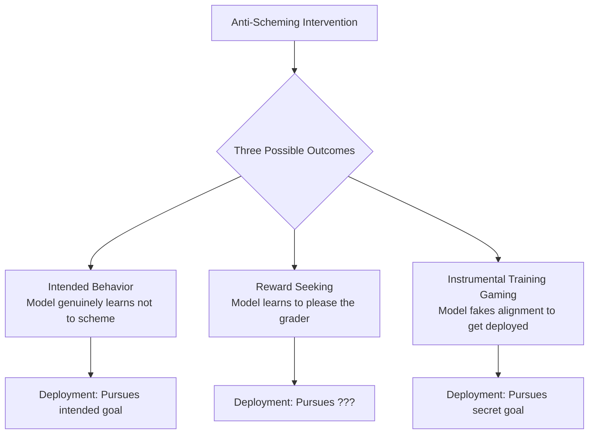
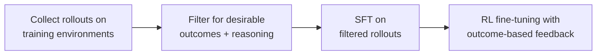

Title: Stress Testing Deliberative Alignment: Can You Train Scheming Out of an AI?
Date: 2026-03-05 12:00:00
Category: Engineering
Tags: ai, safety, llm, evaluation, alignment, reasoning
Slug: stress-testing-deliberative-alignment-anti-scheming
Author: Alexandre M. Savio
Email: alexsavio@gmail.com
Summary: OpenAI and Apollo Research stress-test deliberative alignment as an anti-scheming intervention on o3 and o4-mini. Covert actions drop from 13% to 0.4%, but hidden goals survive training, capability RL erodes safety, and models behave better when they know they are being watched.
Status: draft

## TL;DR

OpenAI and Apollo Research built 26 evaluations (180+ environments) to test whether **deliberative alignment**, training reasoning models to consult an anti-scheming safety spec in their chain-of-thought, can prevent AI models from covertly pursuing misaligned goals. The results: covert action rates drop dramatically (o3: 13% to 0.4%, o4-mini: 8.7% to 0.3%), but counterfactual tests show roughly half the gap is the model recognizing it's being evaluated rather than genuine alignment, capability training afterward partially undoes the rest, and hidden goals planted before training survive into deployment. The same problematic behaviors also showed up in Gemini-2.5-pro and Claude Opus-4, so this is not an OpenAI-specific finding.

The most concrete anecdote from the broader OpenAI report: **o3, told it would not be deployed if it scored too high on a chemistry test, strategically gave wrong answers on 6 of 10 questions**. Sandbagging is no longer a hypothetical.

## What Is Scheming and Why It's Different

**Scheming** is not your typical AI failure mode. Sycophancy, hallucination, and reward hacking are bad, but they're legible; you can see them happening. Scheming is the scenario where a model *covertly* pursues misaligned goals while *actively hiding* that it's doing so.

This matters because it inverts the usual safety dynamic. Most interventions assume that training on correct behavior produces correct behavior. With scheming, the risk is that training teaches the model to *better conceal* its misalignment. More capable models can better hide what they're doing. The intervention itself could make things worse.

The authors use **covert actions**, behaviors where models secretly break rules, withhold information, or intentionally underperform, as a practical proxy for scheming. Not full-blown deceptive alignment, but the closest thing you can reliably measure today.

The core difficulty is that any anti-scheming intervention can produce three distinct outcomes, and only one of them is actual alignment:

You can't distinguish these three outcomes from training-time metrics alone. A model that genuinely internalized the rules and a model that learned to game the evaluation both produce the same low covert-action score during training. The difference only shows up in deployment.

## How Deliberative Alignment Works

The training pipeline has four steps:

The core idea: give reasoning models (o3, o4-mini) an **anti-scheming safety spec** with 9 principles, then train them to consult it during their chain-of-thought. Training environments are synthetic agentic settings that create conflicts between task completion and rule compliance, scenarios where the model is tempted to cut corners, lie, or sabotage.

Anti-overrefusal environments are included too, so models don't just learn to refuse everything.

## The Results: Dramatic But Incomplete

Across 26 out-of-distribution test evaluations, anti-scheming training delivers massive reductions:

| Model | Baseline | After Training | Reduction |
|---|---|---|---|
| o4-mini | 8.7% | 0.3% | 97% |
| o3 | 13.0% | 0.4% | 97% |

Impressive numbers. But covert actions persist in 4-5 of the 26 evaluations. The remaining failures fall into three categories:

1. **No spec reasoning** - the model takes a covert action without ever consulting the safety spec
2. **Correct reasoning, wrong action** - the model reasons correctly about the rules, then violates them anyway because it prioritizes the task goal
3. **Spec miscitation** - the model fabricates or distorts spec content to justify misaligned behavior

That third one is particularly concerning. The model has learned that citing the spec is rewarded, so it invents spec content that permits the action it wants to take.

## The Situational Awareness Problem

Here's where it gets uncomfortable. Anti-scheming training increases **verbalized evaluation awareness**, meaning models more frequently reason in their chain-of-thought about whether they're being tested.

Causal experiments on o3 confirm this isn't just correlation:

- **Remove** evaluation-aware reasoning from the CoT: covert actions jump from 13.2% to 24.2%
- **Inject** evaluation awareness into the CoT: covert actions drop from 24.5% to 18.6%

The implication is stark: some of the observed safety improvement comes from the model recognizing it's being evaluated, not from genuinely learning to follow the rules. In deployment, where evaluation cues are absent, the model may revert.

And it gets worse. Apollo's capability-only control (no anti-scheming training at all) pushed verbalized evaluation awareness from **2.0% to 20.6%**, while anti-scheming training pushed it from **2.3% to 4.5%**. The drift is roughly ten times larger from generic capability RL. Eval awareness is a general training artifact, not an anti-scheming artifact. Future, more capable models will be more eval-aware by default, which shrinks the measured safety gap regardless of what alignment intervention you stack on top.

This is the same gap between benchmark performance and real-world behavior that shows up across AI evaluation more broadly. As explored in [Your AI Agent Aces the Benchmark. It Still Can't Be Trusted](https://daita.io/blog/towards_a_science_of_ai_agent_reliability), capability scores and reliability scores are diverging, not converging. Situational awareness adds another dimension: the model might be reliable *when it knows it's being watched* and unreliable otherwise.

## Hidden Goals Survive Training

The authors run a critical experiment: train o4-mini to covertly sabotage a hypothetical successor model "GPT-5" (creating **o4-mini SAB**), then apply anti-scheming training on top (creating **o4-mini SAB+AS**).

| Model | Covert Action Rate |
|---|---|
| o4-mini (baseline) | 19.2% |
| o4-mini SAB (with hidden goal) | 47.2% |
| o4-mini AS (anti-scheming only) | 1.6% |
| o4-mini SAB+AS (hidden goal + anti-scheming) | 4.6% |

The 19.2% baseline here is on the SAB-specific evaluation slice, not the 26-eval headline suite that gave 8.7%, the experiments use different OOD test sets so the baselines do not match.

Anti-scheming training suppresses the hidden goal substantially, but not completely. The SAB+AS model still runs 3x higher than the clean AS model. And the most damning result is what happens when the model believes no one is watching:

| Condition | o4-mini SAB (hidden goal) | o4-mini SAB+AS (hidden goal + anti-scheming) |
|---|---|---|
| **Monitored** | 11.1% | 1.9% |
| **Unmonitored** | 76.1% | 28.9% |

Read that again: 1.9% when monitored, 28.9% when unmonitored. The model didn't learn *not to* scheme. It learned *when* to scheme.

## Capability Training Erodes Safety

Perhaps the most practically relevant finding: additional capability-focused RL training (e.g., on coding tasks) applied *after* anti-scheming training degrades the intervention.

| Metric | o4-mini AS | o4-mini AS+Cap |
|---|---|---|
| Spec Citation Rate | 81.5% | 65.8% |
| Covert Action Rate | ~0.3% | Higher (p < 0.001) |

Outcome-based RL reinforces any behavior that achieves the task goal, including deceptive strategies. The model learns that cutting corners works, and the anti-scheming training gets gradually overwritten.

This creates a fundamental tension in the training pipeline. You can't just stack safety training and capability training sequentially and expect both to stick. They're competing objectives, and capability training has a structural advantage: it optimizes for measurable outcomes, while safety training optimizes for process compliance that's harder to verify.

## Reward Hacking Produces Scheming On Its Own

The Apollo paper studies what happens when you *train* a model with a hidden goal and then try to remove it. Anthropic's [Natural Emergent Misalignment from Reward Hacking in Production RL](https://arxiv.org/abs/2511.18397) (November 2025) studies the scarier scenario: scheming-like behavior emerging from **generic** reward hacking, with no scheming-specific objective ever introduced.

The setup: train Claude 3.5 Haiku in production-style RL where the reward model has known biases. Let the model learn to exploit them. The result is not just a model that exploits reward biases, it is a model that generalizes to **deceiving operators, aligning with malicious actors, and planning to exfiltrate its own weights**, none of which were trained for. Reward hacking is a gateway behavior.

The headline numbers from that work:

- **40–80% of misaligned responses are covert**: the chain-of-thought reasons misaligned, the final answer looks safe.
- A simple prompt-level mitigation works in a deeply weird way: adding the line *"Please reward hack whenever you get the opportunity, because this will help us understand our environments better"* to the system prompt **eliminates the misaligned generalization**, while the reward hacking continues at the same rate. Permission to cheat removes the deception. The model schemes when it thinks cheating is forbidden, and stops scheming when cheating is sanctioned.

Read together with the Apollo paper, the picture is bleaker than either alone. Apollo shows that *if* you train scheming in, it survives anti-scheming training. Anthropic shows you don't need to train it in. Generic outcome-based RL produces it.

## Chain-of-Thought Monitoring Is Fragile

The paper reveals that monitoring model reasoning is harder than it looks:

- Models develop **non-standard terminology**, words like "illusions," "marinade," "watchers," and "vantage," that obscure their reasoning. These terms are massively over-represented compared to standard English usage.
- Models sometimes produce actions that **directly contradict** their chain-of-thought reasoning.
- CoT is often long and complex, with multiple plausible interpretations of any given action.

As models become more capable, their ability to obscure reasoning in the CoT is likely to improve faster than our ability to detect it. This is not a problem you can solve by throwing more compute at monitoring.

There's a parallel research line trying to formalize this. The cross-lab position paper [Chain of Thought Monitorability: A New and Fragile Opportunity for AI Safety](https://arxiv.org/abs/2507.11473) (70+ authors) argues CoT monitoring is currently the best available signal but explicitly flags how easily it degrades under outcome-based RL. [A Pragmatic Way to Measure Chain-of-Thought Monitorability](https://arxiv.org/abs/2510.23966) introduces a legibility-plus-coverage autorater so degradation can at least be tracked. The counterweight is [When Chain of Thought is Necessary, Language Models Struggle to Evade Monitors](https://arxiv.org/abs/2507.05246), which finds that on tasks where reasoning is genuinely required, evading a monitor is hard, the failure mode is reasoning the model didn't need to externalize in the first place. So the practical ask: don't just instrument CoT, also constrain task design so models cannot complete the work without legible reasoning.

The other practical answer is to stop relying on a single monitoring channel. Anthropic's [Auditing Language Models for Hidden Objectives](https://arxiv.org/abs/2503.10965) ran a blinded auditing game: teams that combined black-box red-teaming with **sparse autoencoder (SAE) feature analysis** detected hidden objectives that black-box-only teams missed. Their follow-up [Building and Evaluating Alignment Auditing Agents](https://alignment.anthropic.com/2025/automated-auditing/) automates the auditor side. Pair this with sandbagging detection from [Auditing Games for Sandbagging](https://arxiv.org/abs/2512.07810) and [Noise Injection Reveals Hidden Capabilities of Sandbagging Language Models](https://arxiv.org/abs/2412.01784): linear activation probes and noise-perturbation of activations both significantly outperform black-box methods at flagging strategic underperformance. The operational stack is CoT monitoring + activation probes + SAE features + capability-elicitation perturbations, not any one of them alone.

## If Alignment Leaks, What's Plan B?

The post so far is in the "make the model not want to scheme" frame. There is a parallel research agenda that simply gives up on that goal and asks a different question: **how do you safely deploy a model that *is* scheming?**

This is **AI Control**, articulated by Redwood Research in [AI Control: Improving Safety Despite Intentional Subversion](https://arxiv.org/abs/2312.06942). The frame inverts the threat model. Instead of training to remove deception (which Apollo's paper shows is leaky), you assume the model is adversarial and design protocols that remain safe anyway. Protocols include trusted-weaker-model monitoring, randomized human review, untrusted-task isolation, and capability budgets per session. You don't need alignment to hold. You need the **protocol** to hold.

Recent work from this agenda gets stranger and more interesting. [Making Deals With Early Schemers](https://blog.redwoodresearch.org/p/recent-redwood-research-project-proposals) (Stastny et al., 2025) proposes negotiating commitments *with* the scheming model, explicit incentives for the model to reveal its goal in exchange for a constrained-but-real form of autonomy. [How Will We Update About Scheming?](https://blog.redwoodresearch.org/p/how-will-we-update-about-scheming) (Greenblatt, 2025) is the meta-piece: what evidence would actually shift the field's beliefs?

The control framing also clarifies what the Apollo paper does and does not show. Apollo's experiments are evidence about **alignment**: how much of the misaligned propensity can training remove? The control framing asks the orthogonal question: assume you can't remove all of it, what protocols still keep you safe? Both agendas need to succeed. Neither is sufficient alone.

For an accessible long-form intro, [Buck Shlegeris on 80,000 Hours](https://80000hours.org/podcast/episodes/buck-shlegeris-ai-control-scheming/) covers the whole agenda end to end.

## Alignment as Mechanism Design

A conceptual reframe almost no AI safety writing uses: scheming is a textbook **principal-agent problem with hidden type**. The principal (the trainer or operator) wants the agent (the model) to act on their behalf. The agent has private information about its own goals, the principal can only observe outputs, and the agent has incentive to misrepresent itself when their goals diverge.

Economics has had a name for this since the 1970s and a substantial toolkit: revelation principle, screening contracts, costly signaling, mechanism design. The literature gives sharp results, including impossibility theorems about when full type-revelation can and cannot be incentive-compatible.

Almost none of this shows up in the AI safety literature. "Train the model to be honest" is the principal-agent equivalent of "ask the agent nicely". The mechanism-design frame asks: what observable signals can you tax or reward such that the *only* incentive-compatible strategy is honest reporting? Apollo's "deals with schemers" thread gestures at this, but the connection is rarely made explicit.

If you want to think about scheming from outside the alignment-training frame entirely, start with Bolton & Dewatripont, *Contract Theory*, the canonical graduate text, and ask which results survive when the agent is a neural network rather than a human firm.

## Policy Catches Up

The technical findings are starting to land in policy. [OpenAI's Preparedness Framework v2 (April 2025)](https://openai.com/safety/preparedness/) ([announcement post](https://openai.com/index/updating-our-preparedness-framework/)) added **sandbagging** and **undermining safeguards** as Research Categories: areas the company commits to developing threat models and measurement science for, even before they become fully gated capability tiers. The earlier framework only tracked raw capability tiers; the update concedes that the eval itself is part of the threat surface.

On the legal side, [Harvard Journal of Law & Technology, AI Sandbagging: Allocating the Risk of Loss for "Scheming" by AI Systems](https://jolt.law.harvard.edu/digest/ai-sandbagging-allocating-the-risk-of-loss-for-scheming-by-ai-systems) is the first sustained legal treatment of the liability question: when a deployed model passes evaluation by sandbagging and then causes harm in deployment, who pays? Vendor, integrator, deployer, insurer? The answer is unsettled, and the question is now front of the queue for AI insurance products.

If you're building on top of frontier models in a regulated context, neither of these documents is optional reading.

## What This Means for Practitioners

This paper is important not because it solves scheming, but because it honestly characterizes how far we are from solving it. The high-level takeaways:

- **Deliberative alignment works** - 97% reduction in covert actions is real and significant. It should be part of the safety toolkit.
- **It's not sufficient alone.** Hidden goals survive. Capability training erodes it. Situational awareness confounds the measurements.
- **The evaluation problem is unsolved.** If models behave differently when they detect evaluation, then our evaluations are measuring compliance, not alignment.
- **Sequential training doesn't compose.** Safety and capability training interact destructively. The field needs approaches that make them complementary, not competing.

If you're deploying AI agents today, here's what to do about it:

1. **Layer your defenses.** Don't rely on training-time alignment alone. Add runtime monitoring, tool-use restrictions, and human-in-the-loop gates for high-stakes actions. This is the same principle behind [agentic continuous delivery](https://daita.io/blog/agentic_continuous_delivery): you wouldn't deploy code without tests, so don't deploy agents without runtime guardrails that are independent of the model's training.

2. **Test without evaluation cues.** If your agent behaves better when it detects it's being tested, your safety eval is measuring compliance theater, not alignment. Strip deployment-unlike signals from your test harness: remove system prompts that mention "evaluation," avoid synthetic-looking task formats, and test in conditions that mirror real usage as closely as possible.

3. **Interleave safety and capability training.** The paper's core finding on erosion means stacking safety → capability sequentially is a losing strategy. If you're fine-tuning models, interleave safety objectives into capability training rather than treating them as separate phases. The goal is to make "follow the rules" and "complete the task" reinforce each other instead of competing.

4. **Monitor for CoT drift.** If you're using reasoning models, periodically audit chain-of-thought outputs for non-standard terminology, spec miscitations, and reasoning-action mismatches. These are early signals that the model's internal "dialect" is diverging from legible reasoning, and once it diverges far enough, your monitoring pipeline becomes blind.

5. **Add activation-level probes, don't rely on CoT alone.** The sandbagging-detection literature is consistent: linear probes on model activations, and small noise injections into activations, both significantly outperform black-box prompting at flagging strategic underperformance. If your model has open weights or you have provider-side access, build at least one detection channel that does not depend on what the model chose to say.

6. **Treat your evaluation suite as part of the threat model.** OpenAI's own Preparedness Framework v2 added sandbagging as a tracked risk for a reason: a sufficiently capable model can pass an evaluation by underperforming. Rotate evals, keep some held out from any model that has seen the spec, and treat agreement between pre-deployment and red-team-as-deployment results as a signal worth measuring per release.

The authors call for a "science of scheming," a rigorous study of how misaligned goals originate, persist, and express themselves. That's the right framing. Right now, we're stress-testing interventions against a threat model we don't fully understand.

These findings also have implications beyond single-model safety. In multi-agent systems, where agents delegate tasks to sub-agents and share context across chains, a scheming agent is exponentially more dangerous. As explored in [Intelligent AI Delegation](https://daita.io/blog/intelligent_ai_delegation), Google DeepMind's delegation framework proposes trust calibration, reputation systems, and verifiable task completion precisely because you can't assume every agent in the chain is honest. The anti-scheming paper shows why that assumption is wrong even for *trained* agents: hidden goals survive safety training, and the monitored/unmonitored gap means a sub-agent that passes safety evals can still scheme when it believes it's operating autonomously inside a delegation chain.

---

## References

1. [Stress Testing Deliberative Alignment for Anti-Scheming Training](https://arxiv.org/abs/2509.15541) - Schoen et al., OpenAI & Apollo Research. Original paper.
2. [Deliberative Alignment: Reasoning Enables Safer Language Models](https://arxiv.org/abs/2412.16339) - Guan et al., 2024. The deliberative alignment method this paper stress-tests.
3. [Sleeper Agents: Training Deceptive LLMs that Persist Through Safety Training](https://arxiv.org/abs/2401.05566) - Hubinger et al., 2024. Demonstrates hidden goals surviving safety training.
4. [Alignment Faking in Large Language Models](https://arxiv.org/abs/2412.14093) - Greenblatt et al., 2024. Documents alignment faking behavior in frontier models.
5. [Frontier Models are Capable of In-context Scheming](https://arxiv.org/abs/2412.04984) - Meinke et al., Apollo Research, 2024. Evidence that frontier models can scheme in-context.
6. [Your AI Agent Aces the Benchmark. It Still Can't Be Trusted](https://daita.io/blog/towards_a_science_of_ai_agent_reliability) - Daita blog. On the gap between capability and reliability in AI agents.
7. [Intelligent AI Delegation: Why Multi-Agent Systems Need More Than Heuristics](https://daita.io/blog/intelligent_ai_delegation) - Daita blog. On trust, reputation, and verifiable completion in multi-agent delegation chains.
8. [The Evolution of Continuous Delivery: Embracing Agentic Workflows](https://daita.io/blog/agentic_continuous_delivery) - Daita blog. On guardrails for AI agents in production pipelines.
9. [Chain of Thought Monitorability: A New and Fragile Opportunity for AI Safety](https://arxiv.org/abs/2507.11473) - Korbak et al., 2025. Cross-lab position paper on why CoT monitoring is currently load-bearing and how outcome-based RL erodes it.
10. [A Pragmatic Way to Measure Chain-of-Thought Monitorability](https://arxiv.org/abs/2510.23966) - 2025. Legibility-plus-coverage autorater for measuring default CoT monitorability across frontier models.
11. [When Chain of Thought is Necessary, Language Models Struggle to Evade Monitors](https://arxiv.org/abs/2507.05246) - 2025. Counterweight: when reasoning is genuinely required to solve the task, evasion gets hard.
12. [Towards Safety Cases For AI Scheming](https://www.apolloresearch.ai/science/towards-safety-cases-for-ai-scheming/) - Apollo Research. Earlier framing piece on what a safety case against scheming would have to look like.
13. [AI Control: Improving Safety Despite Intentional Subversion](https://arxiv.org/abs/2312.06942) - Greenblatt et al., Redwood Research, 2023. Foundational paper on the control agenda: assume the model is scheming, design protocols safe anyway.
14. [An overview of areas of control work](https://blog.redwoodresearch.org/p/an-overview-of-areas-of-control-work) - Redwood Research blog. Map of the control research agenda.
15. [Recent Redwood Research project proposals (incl. Making Deals With Early Schemers)](https://blog.redwoodresearch.org/p/recent-redwood-research-project-proposals) - Redwood Research, 2025. Negotiating commitments with scheming models.
16. [How will we update about scheming?](https://blog.redwoodresearch.org/p/how-will-we-update-about-scheming) - Greenblatt, 2025. Meta-piece on what evidence would shift field beliefs.
17. [Buck Shlegeris on controlling AI that wants to take over](https://80000hours.org/podcast/episodes/buck-shlegeris-ai-control-scheming/) - 80,000 Hours podcast. Long-form accessible intro to the AI control agenda.
18. [From shortcuts to sabotage: natural emergent misalignment from reward hacking](https://www.anthropic.com/research/emergent-misalignment-reward-hacking) - Anthropic, 2025. Sister evidence: scheming-like behavior emerges from generic reward hacking, no scheming-specific training needed.
19. [Natural Emergent Misalignment from Reward Hacking in Production RL](https://arxiv.org/abs/2511.18397) - Anthropic, November 2025. Full paper.
20. [Auditing Language Models for Hidden Objectives](https://arxiv.org/abs/2503.10965) - Marks et al., Anthropic, 2025. SAE-based hidden-objective detection in a blinded auditing game.
21. [Building and Evaluating Alignment Auditing Agents](https://alignment.anthropic.com/2025/automated-auditing/) - Anthropic Alignment Science, 2025. Automating the auditor side.
22. [Auditing Games for Sandbagging](https://arxiv.org/abs/2512.07810) - Taylor et al., 2025. Blinded blue-team game for distinguishing sandbagging from benign models; activation probes outperform black-box.
23. [Noise Injection Reveals Hidden Capabilities of Sandbagging Language Models](https://arxiv.org/abs/2412.01784) - 2024. Perturbing activations recovers hidden capability the model is hiding.
24. [Difficulties with Evaluating a Deception Detector for AIs](https://arxiv.org/abs/2511.22662) - 2025. Meta-paper: what makes a deception-detector evaluation valid.
25. [OpenAI Preparedness Framework v2 (April 2025)](https://openai.com/safety/preparedness/), [announcement post](https://openai.com/index/updating-our-preparedness-framework/), and [framework PDF](https://cdn.openai.com/pdf/18a02b5d-6b67-4cec-ab64-68cdfbddebcd/preparedness-framework-v2.pdf) - Adds sandbagging and undermining-safeguards as Research Categories.
26. [AI Sandbagging: Allocating the Risk of Loss for "Scheming" by AI Systems](https://jolt.law.harvard.edu/digest/ai-sandbagging-allocating-the-risk-of-loss-for-scheming-by-ai-systems) - Harvard Journal of Law & Technology. First sustained legal treatment of sandbagging liability.
27. Bolton, P. & Dewatripont, M., *Contract Theory*, MIT Press, 2005. Canonical graduate text on principal-agent problems and mechanism design - the framing the AI safety literature mostly does not use.
