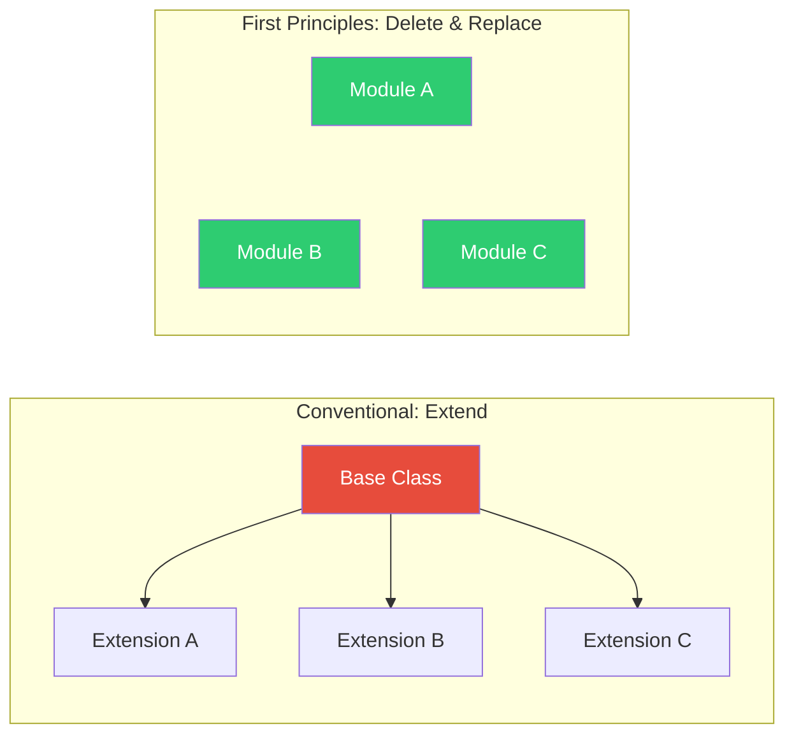
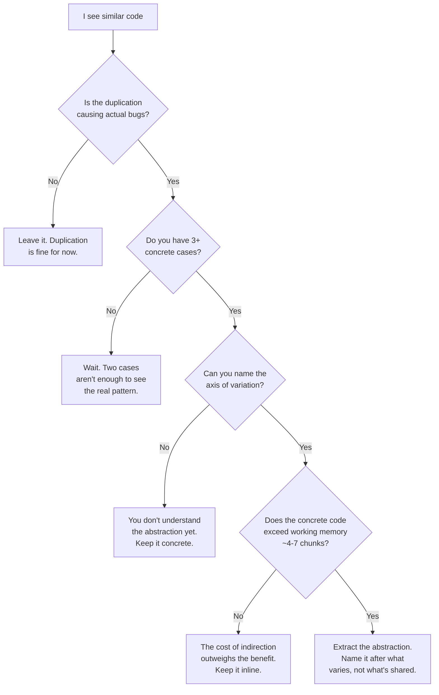

Title: First Principles: Software Design
Date: 2026-03-21 11:00:00
Category: Development
Tags: software-design, first-principles, software-engineering, architecture, complexity
Slug: first-principles-software-design
Author: Alexandre M. Savio
Email: alexsavio@gmail.com
Summary: Strip away the design patterns, the SOLID principles, and the architecture astronautics. What's actually true about software design when you reason from fundamentals? Five irreducible truths, three reconstruction principles, and a framework for making design decisions based on cognitive load, not convention.
Status: published

## TL;DR

Most software design advice is convention dressed up as truth. When you strip away the inherited thinking, only five things survive scrutiny: software transforms input to output, human working memory is limited, change costs dominate creation costs, coupling determines blast radius, and naming compresses complexity. Rebuilding from these truths produces a discipline centered on cognitive load management and deletability, not extensibility and pattern compliance.

## The Conventional View

Software design, as typically taught and practiced, is about organizing code into clean abstractions, following established patterns (MVC, microservices, hexagonal architecture), applying SOLID principles, and writing extensible systems that anticipate future change. Good design means separation of concerns, low coupling, high cohesion, and layers of indirection that make the system "flexible."

Most of this is convention. Some of it is useful. Very little of it is fundamental.

## The Assumptions We Carry

Before deconstructing, let's name the beliefs most developers absorb without questioning:

| # | Assumption | Origin | Verdict |
|---|-----------|--------|---------|
| 1 | Good design means anticipating future requirements | OOP textbooks, enterprise culture | Baggage |
| 2 | More abstraction = better design | Academic CS, design pattern movement | Baggage |
| 3 | Code should be DRY (Don't Repeat Yourself) | The Pragmatic Programmer (1999) | Heuristic |
| 4 | Separation of concerns produces better systems | Dijkstra (1974), proven by experience | Fundamental |
| 5 | Design patterns are the vocabulary of good design | Gang of Four (1994), Java enterprise culture | Baggage |
| 6 | Systems should be loosely coupled | Parnas (1972), empirically validated | Fundamental |
| 7 | You need an architecture before you write code | Waterfall legacy, enterprise planning culture | Baggage |
| 8 | Good code is reusable code | Library/framework culture, DRY extrapolation | Baggage |
| 9 | Complexity must be managed through indirection | Enterprise Java, layered architecture dogma | Heuristic |
| 10 | Tests prove your design is correct | TDD movement, Agile culture | Heuristic |

That's three fundamentals, three heuristics, and four pieces of baggage. Let's see what survives.

## What Survives Scrutiny

Each assumption was tested against three questions: Is this a law or a convention? What's the evidence? What function does the assumption serve?

Five irreducible truths emerged:

**1. Software exists to model a transformation from input to output.** At its most fundamental, every program takes some state of the world and produces a different state. Design is the act of choosing how to decompose that transformation. This is mathematical, it survives regardless of language, paradigm, or era.

**2. Humans have limited working memory (~4-7 chunks).** This is cognitive science, not convention. Miller's 1956 research established the limits, and John Sweller's **Cognitive Load Theory** refined the model into three types: *intrinsic* load (the inherent complexity of the problem), *extraneous* load (complexity added by how information is presented), and *germane* load (effort spent building mental models). Software design's job is to minimize extraneous cognitive load, the complexity that exists because of *how the code is organized* rather than *what the code does*. Any system that requires a person to hold more than 4-7 chunks in their head simultaneously will produce errors. This is the actual root reason separation of concerns works. Not because it's "clean," but because human brains have hard limits.

**3. The cost of change dominates the cost of creation.** Empirically, across decades of industry data, modifying existing systems costs far more than writing them initially. Design choices compound: each decision constrains or enables future decisions.

**4. Coupling between components determines the blast radius of change.** When A depends on B, changing B risks breaking A. This is structural, not opinion. The fewer dependencies a component has, the cheaper it is to change in isolation. Parnas demonstrated this in 1972 and nothing has invalidated it.

**5. Naming is compression.** A name (function, module, variable) lets humans treat a complex thing as a single chunk in working memory. Good names reduce cognitive load. Bad names increase it. This follows directly from truth #2.

## What Falls Away

Four assumptions classified as baggage, and the reasons they persisted:

**"Anticipate future requirements."** This feels responsible and professional. In practice, humans are terrible at predicting what will change. Studies show that speculative generality creates more waste than it prevents. The assumption confuses *making change cheap* (valuable) with *predicting what will change* (impossible).

**"More abstraction = better design."** Abstraction has a cost: indirection. Every layer you add is a layer someone must navigate to understand the system. Abstractions feel intellectually satisfying and they're easy to teach. But abstraction is only valuable when it reduces net cognitive load, when the thing being hidden is more complex than the interface replacing it. Premature abstraction *increases* total complexity.

**"Design patterns are the vocabulary."** The Gang of Four patterns were documented as recurring solutions in C++ and Smalltalk in 1994. Many exist to work around language limitations: Visitor, Strategy, and Observer are all compensating for missing first-class functions or pattern matching. Reaching for a pattern before understanding the problem adds accidental complexity.

**"Good code is reusable code."** Reusability requires predicting how code will be reused, a form of future prediction. Making code reusable adds generality, parameters, and configuration that increase complexity *now* for hypothetical benefit *later*. Most "reusable" code is used exactly once. The assumption persists because reusability sounds economical.

## The Heuristics: Handle With Care

Three assumptions survived as context-dependent guidelines, not laws:

**DRY** is useful when duplication causes *bugs* (changing one copy but forgetting the other). It's harmful when it creates premature abstractions that couple unrelated things. The question is not "is this duplicated?" but "is this duplication causing actual problems?"

Here's what happens when DRY goes wrong. You notice three functions that look similar, so you "extract the commonality":

```python
# The DRY trap: one function, 16 code paths, nobody understands it
def process_record(
    record: dict,
    validate: bool = True,
    enrich: bool = False,
    normalize: bool = True,
    emit_event: bool = False,
) -> dict:
    if validate:
        _validate(record)
    if enrich:
        record = _fetch_enrichment(record)
    if normalize:
        record = _normalize(record)
        if enrich and not validate:
            record = _special_case_enriched_unnormalized(record)
    if emit_event:
        _publish(record)
    return record
```

Versus the "duplicated" version:

```python
# Three functions, each trivially understandable
def ingest_from_api(record: dict) -> dict:
    validate(record)
    return normalize(record)

def ingest_from_partner(record: dict) -> dict:
    validate(record)
    record = fetch_enrichment(record)
    return normalize(record)

def ingest_from_migration(record: dict) -> dict:
    record = normalize(record)
    publish(record)
    return record
```

The first version is "DRY." It's also a combinatorial minefield where every new caller adds another boolean flag and another implicit code path. The second version has some repeated lines, but each function fits entirely in working memory. You can change `ingest_from_migration` without any risk of breaking the API ingestion path.

**Indirection for complexity management** works when the thing being hidden is genuinely complex. It fails when the indirection itself becomes the complexity. Every layer of indirection is a cognitive tax, justified only when the tax is less than the complexity it hides.

**Tests as design validation** provides signal about the external behavior of a system, not about its internal design quality. Tests can pass for poorly designed systems and fail for well-designed ones during refactoring. Tests verify *what* the system does, not *how well* it's structured.

## Rebuilt From Scratch

Starting from only the five truths, here's software design rebuilt from the ground up:

**Design is cognitive load management.** Every design decision should be evaluated by one question: *does this make the system easier or harder for a human to hold in their head?* Not "is this clean," not "does this follow SOLID," not "is this extensible," but does it reduce the number of things a person must simultaneously understand to make a correct change?

This produces three principles:

### Principle 1: Optimize for Deletion, Not Extension

Since we can't predict what will change but we know change will happen, the best design makes components easy to *remove and replace* rather than easy to extend. Small, independent units with clear boundaries. If you can delete a module and replace it with a different implementation without touching other modules, your design is good. You don't need plugin architectures or abstract factories. You need components small enough to throw away.



In the conventional model, the base class is a single point of failure for change. In the first-principles model, any module can be deleted and rewritten without cascading effects.

Here's the difference in code. The "extensible" version:

```python
# The Strategy Pattern way: 5 files, 3 abstractions, 1 actual behavior
class NotificationStrategy(ABC):
    @abstractmethod
    def send(self, user: User, message: str) -> None: ...

class EmailStrategy(NotificationStrategy):
    def send(self, user: User, message: str) -> None:
        smtp_client.send(user.email, message)

class NotificationService:
    def __init__(self, strategy: NotificationStrategy):
        self._strategy = strategy

    def notify(self, user: User, message: str) -> None:
        self._strategy.send(user, message)

# Usage: requires a factory or DI container to wire up
service = NotificationService(EmailStrategy())
service.notify(user, "Hello")
```

The "deletable" version:

```python
# The direct way: 1 file, 0 abstractions, same behavior
def send_email(user: User, message: str) -> None:
    smtp_client.send(user.email, message)

# Usage: call the function
send_email(user, "Hello")
```

The second version is three lines. A new developer understands it instantly. When you need SMS notifications six months from now, you write `send_sms()` next to it. You don't need to predict whether notifications will vary by channel, by urgency, by user preference, or by some axis you haven't imagined yet. You just write the next function when you need it.

### Principle 2: Inline Until It Hurts, Then Extract

Since abstraction has a cost (cognitive load of indirection) and a benefit (cognitive load reduction via naming), the right time to abstract is when the *concrete* code exceeds working memory, not before. Start with the simplest, most direct implementation. Duplicate if necessary. When you see *actual* repetition causing *actual* bugs or *actual* difficulty understanding the code, extract an abstraction. The abstraction is justified by present pain, not hypothetical future benefit.

### Principle 3: Make Dependencies Visible and Explicit

Since coupling determines blast radius, and since humans need to understand impact before making changes, dependencies should be obvious in the code structure. No action-at-a-distance. No implicit global state. No "magic" that connects things behind the scenes. A developer reading a module should be able to see, without tooling, what it depends on and what depends on it.

## The Design Process That Follows

Combining these principles produces a process:

1. Write the simplest code that transforms input to output correctly
2. When a single unit exceeds what you can hold in your head, extract and name a sub-unit
3. When changing one thing keeps breaking another, introduce a boundary
4. When you find yourself making the same change in multiple places and getting it wrong, *then* deduplicate
5. Regularly ask: "could I delete this component and rewrite it in a day?" If not, it's too big

This is not "no design." It's design driven by empirical signals rather than speculative principles.

### Should I Abstract This?

When you're staring at similar code and feeling the DRY reflex, run through this:



Most of the time, you end up on the left side. That's the point.

## Evidence From the Wild

These principles aren't theoretical. Some of the most successful software projects in history embody them, often without using the vocabulary.

**SQLite** is a single C file (amalgamation) with no external dependencies. It's the most deployed database in the world, running on every smartphone, browser, and embedded device. Its design optimizes ruthlessly for understandability: one file, clear module boundaries within that file, and zero abstraction layers between you and the SQL engine. Any developer can read it top to bottom. The result? Decades of reliability with a tiny team.

**Redis** started as a flat, single-threaded C codebase with almost no abstraction layers. Salvatore Sanfilippo famously resisted adding features that would require architectural complexity. Each data structure is its own self-contained implementation. The result is a system that a single developer can hold in their head, which is why it has remarkably few bugs for its ubiquity.

**Go's standard library** takes the opposite approach from Java's. Instead of deep inheritance hierarchies and abstract factories, it uses flat packages with concrete types. The `net/http` package is a good example: you can read the Handler interface (two lines) and start building. No framework, no middleware abstractions, no dependency injection. When you need middleware, you write a function that wraps a Handler. The "design pattern" is just functions calling functions.

Contrast these with **early Enterprise Java** (EJB 2.x era), where a simple "save a record to a database" required a Home interface, a Remote interface, a Bean implementation, a deployment descriptor, and a JNDI lookup. Six files and three abstraction layers for something that should be one function call. The cognitive load was so extreme that an entire cottage industry of "simplification" frameworks (Spring, Hibernate) emerged just to make Java usable, each adding their own layers of indirection.

The pattern is consistent: systems that optimize for human understanding over architectural purity tend to be more reliable, longer-lived, and maintained by smaller teams.

## But What About Large Systems?

The biggest objection to this approach: "This works for small projects, but real systems at scale need architecture."

This conflates two things. Large systems *do* need structure. But that structure doesn't need to come from speculative upfront architecture or pattern catalogs. It can emerge from the same principles applied recursively.

The **Linux kernel** is over 30 million lines of code. It has no grand architectural diagram that was designed before coding started. Instead, it's organized as subsystems (networking, filesystems, drivers, scheduling) where each subsystem is relatively independent, with clear interfaces at the boundaries. Individual subsystems are small enough that their maintainers can hold them in their heads. The macro structure emerged from decades of applying "keep components independent and boundaries clear" at every scale.

The key insight: **a large system is not a large component. It's many small components with clear boundaries between them.** The principles don't change at scale, they're applied recursively:

- Each component should be deletable and replaceable
- Each component should fit in one developer's working memory
- Dependencies between components should be visible and explicit
- When a component gets too big to understand, split it

The difference between a well-structured large system and a "big ball of mud" is not the presence of design patterns or architectural frameworks. It's whether each piece is small enough to understand and independent enough to change safely.

## What Changes

| Conventional Thinking | First-Principles Thinking |
|---|---|
| Plan the architecture upfront | Let structure emerge from actual needs |
| Abstract early to enable flexibility | Inline until concrete pain forces extraction |
| Design for extensibility | Design for deletability |
| Apply patterns as building blocks | Solve the specific problem; patterns may emerge |
| DRY as a rule | Duplication is cheaper than the wrong abstraction |
| Layers and indirection for "clean" separation | Indirection only when it reduces net cognitive load |
| Reusable components are an asset | Single-purpose, throwaway components are an asset |
| Good design prevents future problems | Good design makes future problems cheap to fix |

## Implications

- **Measure design quality by time-to-understand.** When reviewing code, ask: "How long would it take a new team member to understand this module well enough to change it safely?" That's your design quality metric. Not how many SOLID principles it follows.

- **Treat duplication as a feature until it isn't.** Two similar functions are easier to understand than one generic function with a boolean parameter. Wait until you have *three* cases and can see the *actual* axis of variation before abstracting.

- **Invest in naming over structure.** A well-named function in a flat file is often better design than a poorly-named class in a perfect inheritance hierarchy. Naming is the highest-leverage design tool because it directly addresses the cognitive load constraint.

- **Design for the team you have.** If your team struggles with complex type hierarchies, simpler designs with more duplication will produce fewer bugs. Design quality is relative to the humans who must work with it.

- **Stop designing for requirements you don't have.** The next time you're tempted to add a parameter, interface, or configuration option "in case we need it," don't. You're adding complexity now to solve a problem that probably won't arrive, and if it does, you'll probably solve it differently than you imagined.

This approach connects to the same reasoning in [First Principles: Software Observability]({filename}/first_principles_software_observability.md), where stripping away the "three pillars" marketing reveals that observability is really about answering novel questions about system behavior. Both disciplines converge on the same meta-principle: optimize for human understanding of complex systems, not for adherence to inherited frameworks.

---

## References

1. Parnas, D.L. (1972). "On the Criteria To Be Used in Decomposing Systems into Modules" - foundational work on information hiding and coupling
2. Gamma, E. et al. (1994). "Design Patterns: Elements of Reusable Object-Oriented Software" - the Gang of Four book
3. Hunt, A. & Thomas, D. (1999). "The Pragmatic Programmer" - origin of DRY principle
4. Dijkstra, E.W. (1974). "On the role of scientific thought" - origin of separation of concerns
5. Miller, G.A. (1956). "The Magical Number Seven, Plus or Minus Two" - working memory limits
6. Sweller, J. (1988). "Cognitive Load During Problem Solving" - Cognitive Load Theory, distinguishing intrinsic, extraneous, and germane load
7. Sandi Metz (2014). "The Wrong Abstraction" - duplication vs wrong abstraction argument
8. [First Principles: Software Observability]({filename}/first_principles_software_observability.md) - related first-principles analysis
